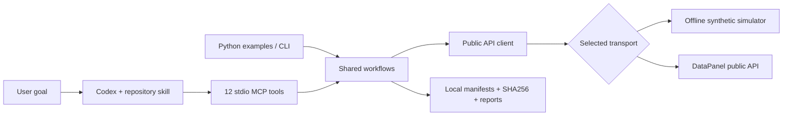

<p align="center"></p>

<p align="center">
  <a href="README.zh-CN.md">简体中文</a> ·
  <a href="#quickstart">Quickstart</a> ·
  <a href="docs/codex.md">Connect Codex</a> ·
  <a href="https://datapanel.dev/developers.html">DataPanel API</a>
</p>

<p align="center">
  
  
  
  
</p>

**Give Codex a goal. Let it discover the data, respect the budget, and return verifiable artifacts.**

A small, inspectable Python cookbook for agents using the DataPanel public API. It includes twelve runnable workflows, a real stdio MCP bridge, a repository skill, copyable prompts, and failure-path tests. Start with a completely offline demo; switch individual workflows to your own account when ready.


The [two-GPU DDP extension](docs/multi-gpu.md) now has conditional code and offline arithmetic/evidence checks. Use it only after a compatible two-GPU runtime is published and enabled for your account; a fixed single-GPU template does not satisfy that requirement.

```text
“Find the data I can actually access. Check its coverage.
 Freeze a platform-side data selection, then prepare a capped compute quote.
 Stop before execution and give me an evidence-based research brief.”
```


## Why this repo

| What an agent needs | What this cookbook demonstrates |
|---|---|
| Find usable data | Bounded catalog pagination; gaps, overlaps and truncation stay visible |
| Complete long operations | Save the idempotency key before submission; resume the same task |
| Trust an artifact | Stream to `.part`, bound size, verify SHA256, then publish locally |
| Respect account boundaries | Private exports use the authenticated gateway; no key in object-store requests |
| Control resources | Discover profiles, freeze source/data identities, inspect a capped quote |
| Report honestly | Separate accepted, ready, verified, cancel-requested and terminal states |
| Work naturally in Codex | Twelve MCP tools, a workflow prompt and a discoverable repository skill |

## Quickstart

Python 3.10+; no API key, model subscription or cloud account is needed for the offline demo.

```bash
# From the repository root
python -m venv .venv
source .venv/bin/activate
python -m pip install -e ".[dev]"

datapanel-demo all
python -m pytest -q
```

On Windows PowerShell, activate with `.venv\Scripts\Activate.ps1`. The Python commands are otherwise identical. If shell activation is unavailable, use `.venv/bin/python` on POSIX or `.venv\Scripts\python.exe` on Windows.

The demo emits one JSON record per scenario and writes redacted evidence beneath `work/mock/`. Its mock is an in-process HTTP transport: **no network calls and no real quota consumption**. Private exports verify bytes and SHA256; historical market files stay in platform compute. `work/` is ignored by Git.

```bash
# Run one self-contained entry point
python examples/04_data_access.py

# Or choose a workflow by name
datapanel-demo coverage
datapanel-demo quote
datapanel-demo research-brief
```

## Workflow gallery

The detailed scenario guides are in Chinese; commands, code, API contracts and output keys are shared across languages.

| # | Workflow | Agent outcome | Live side effect |
|---|---|---|---|
| 01 | [Account & quota](docs/01_account.md) | Subscription and usage summary | None |
| 02 | [Catalog discovery](docs/02_catalog.md) | Actual published partitions | None |
| 03 | [Coverage audit](docs/03_coverage.md) | Gaps, overlaps and limits | None |
| 04 | [Platform data access](docs/04_download.md) | Query compute access; raw market exports retired | Read only |
| 05 | [Incremental plan](docs/05_incremental.md) | Missing partitions from a checkpoint | None |
| 06 | [Private source](docs/06_source.md) | Sealed source asset with matching hash | Creates an asset |
| 07 | [Dataset snapshot](docs/07_snapshot.md) | Frozen selection identity | Creates a snapshot |
| 08 | [Capped quote](docs/08_quote.md) | Source + data + resources + budget | Creates planning assets |
| 09 | [Execution gate](docs/09_execution_gate.md) | Current availability, no implicit launch | None |
| 10 | [Job lifecycle](docs/10_job_lifecycle.md) | Cancellation request and independent readback | Requests cancellation |
| 11 | [Private export](docs/11_private_export.md) | Verified owned artifact via gateway | Export/content quota |
| 12 | [Research brief](docs/12_research_brief.md) | Evidence, gaps and next decisions | Local report only |

## Connect Codex

The MCP bridge uses the official Python MCP SDK and the stdio transport supported by Codex. Install the `mcp` or `dev` extra, then add the following to your Codex MCP configuration, replacing both absolute paths. [Official Codex MCP reference](https://developers.openai.com/codex/mcp).

```toml
[mcp_servers.datapanel]
command = "/absolute/path/to/repo/.venv/bin/python"
args = ["-m", "datapanel_agent.mcp_server"]
cwd = "/absolute/path/to/repo"
env_vars = ["DATAPANEL_API_KEY"]

[mcp_servers.datapanel.env]
DATAPANEL_MODE = "mock"
DATAPANEL_ALLOW_WRITES = "0"
```

Use the corresponding absolute Python executable on Windows. The key is forwarded from the parent environment; it is never embedded in the config. Mock mode intentionally allows synthetic operations regardless of the live-write setting.

Open this repository in Codex, enable the configured MCP server, then try:

> Use `$datapanel-workflows` to inspect the demo account, find BTCUSDT trade partitions, identify missing dates, and freeze one available partition for platform-side compute. Verify the result and prepare a quote without running a job. State clearly which evidence is synthetic.

See [MCP setup and tool catalog](docs/codex.md), [prompt recipes](docs/prompts.md), and [the repository skill](.agents/skills/datapanel-workflows/SKILL.md). Running the deterministic demo does not invoke a language model; the MCP bridge lets your Codex session orchestrate those same operations.

## Switch to a real account

```bash
# Set DATAPANEL_API_KEY privately in the parent process environment.
datapanel-demo account --mode live
datapanel-demo catalog --mode live

# Copy an actual catalog selection into your ignored work/ directory.
datapanel-demo data-access --mode live
```

Read [the live guide](docs/live-guide.md) before stateful operations. Live mode never runs `all`: each operation requires its own inputs. `--allow-writes` enables the requested scenario; it does not grant permission for unrelated purchases, job launches or cancellation. The adapter provides no billing checkout or admin tools.

## Architecture



All reusable behavior is in [the client](src/datapanel_agent/client.py) and [the workflows](src/datapanel_agent/workflows.py). The mock replaces HTTP transport, not the workflow itself. The same private-export, polling, budget and verification code runs in both modes.

## Validation and contribution

```bash
python -m pytest -q
ruff check .
ruff format --check .
python scripts/verify_examples.py
python scripts/check_repository.py
```

Tests include a real MCP subprocess session, all twelve workflows, ambiguous submission recovery, retry limits, unsafe redirect rejection, credential separation, integrity failures, cancellation semantics and bounded pagination. GitHub Actions is configured for Python 3.10 and 3.12 on Linux and Windows; workflow execution on GitHub is pending publication, not claimed as completed.

[API contract](docs/api-contract.md) · [Troubleshooting](docs/troubleshooting.md) · [Contributing](CONTRIBUTING.md) · [Security](SECURITY.md)

This repository contains integration examples. It does not include proprietary market data, production credentials, an execution environment, or DataPanel server source.

## Next: GPU model training through DataPanel


固定 GPU 模板的离线输入准备见 [中文说明](docs/gpu-template.zh-CN.md)。该模板仅单卡，使用独立的输入与报价接口；账户准入与多卡能力须分别确认。

Start with [your first model](docs/custom-features.md): write features, select market data, submit training and retrieve a model. AI assistants can use the separate [DataPanel skill](.agents/skills/datapanel-workflows/SKILL.md).

[当前 API 与旧版迁移 / API migration](docs/migration.md)：行情文件导出已停用，GPU 固定模板使用独立入口。
