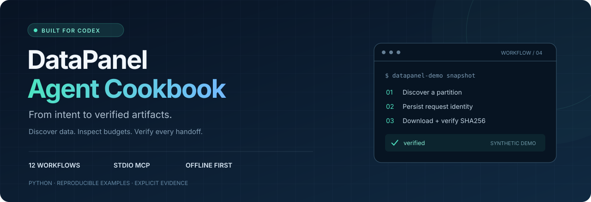

<p align="center"></p>

<p align="center"><a href="README.md">English</a> · <a href="docs/codex.md">接入 Codex</a> · <a href="docs/prompts.md">提示词手册</a> · <a href="https://datapanel.dev/developers.html">DataPanel API 文档</a></p>

**用一句话描述目标，让 Codex 发现数据、检查预算、完成调用，并交付可核验的结果。**

这是一套面向 Codex / AI agent 的 DataPanel 示例仓库：12 个可运行场景、12 个 MCP 工具、一个仓库级 skill，以及覆盖异常路径的测试。可以先不联网跑通全部演示，再逐个切换到自己的真实账户。


[双卡 DDP 条件示例](docs/multi-gpu.md)已补充分片、同步和证据检查；使用前须确认平台已发布兼容的双卡运行环境并向账户开放；固定单卡模板不能替代多卡。

> “帮我找到实际可用的数据，检查时间缺口，冻结一个数据快照，然后申请一份有预算上限的算力报价；先不要执行，给我整理研究简报。”


## 三分钟运行

准备 Python 3.10+，在仓库根目录执行：

```bash
python -m venv .venv
source .venv/bin/activate
python -m pip install -e ".[dev]"
datapanel-demo all
python -m pytest -q
```

Windows PowerShell 使用 `.venv\Scripts\Activate.ps1` 激活。首次安装依赖需要网络；安装后 mock 演示完全离线，不需要 OpenAI / DataPanel API key，不启动远程计算，不消耗真实额度。

每个场景输出一条 JSON，并将已脱敏的结果写入 `work/mock/<场景>/`。目录被 Git 忽略。私有产物导出会核验文件大小与 SHA256；历史行情文件不对外导出。

## 场景导航

| # | 场景 | 自然语言目标 | 关键能力 |
|---|---|---|---|
| 01 | [账户与额度](docs/01_account.md) | 我能用哪些服务，还有多少额度？ | 订阅、用量、积分单位 |
| 02 | [数据发现](docs/02_catalog.md) | 找到实际发布的行情分区 | 分页、过滤、截断标记 |
| 03 | [覆盖审计](docs/03_coverage.md) | 选取数据前找出时间缺口 | 缺口、重叠、负结果 |
| 04 | [平台内数据访问](docs/04_download.md) | 查询研究数据如何使用 | 行情留在平台内计算 |
| 05 | [增量计划](docs/05_incremental.md) | 只规划尚未核验的分区 | 检查点、幂等式规划 |
| 06 | [私有源码](docs/06_source.md) | 保存源码并确认哈希一致 | 私有上传、字节口径 |
| 07 | [数据快照](docs/07_snapshot.md) | 冻结研究输入 | 授权选择、清单身份 |
| 08 | [预算报价](docs/08_quote.md) | 最多 1 积分，先报价不执行 | profile、费率、到期时间 |
| 09 | [执行开关](docs/09_execution_gate.md) | 未开放时如实停止 | 能力发现、不绕过限制 |
| 10 | [任务管理](docs/10_job_lifecycle.md) | 取消指定任务并回读 | 中间状态与终态分离 |
| 11 | [私有导出](docs/11_private_export.md) | 取回我的结果并校验 | 同源鉴权、拒绝重定向 |
| 12 | [研究简报](docs/12_research_brief.md) | 整理证据、局限及下一步 | Markdown 报告、未资格化标记 |

```bash
python examples/04_data_access.py
datapanel-demo coverage
datapanel-demo quote
datapanel-demo research-brief
```

## 让 Codex 直接调用

训练示例可先独立运行：

```bash
python examples/training/cpu_model.py --work-dir work/cpu-fixture
```

真实训练使用明确的预算、公开 profile 和 `--submit`，详见 [训练教程](docs/training.zh-CN.md)。GPU 不可用时不会回退 CPU，也不会把离线检查记作 GPU 验收。

1. 按 [接入指南](docs/codex.md) 配置本仓库的 stdio MCP；先保持 mock 模式。
2. 在 Codex 打开本仓库，让仓库级 `.agents/skills/datapanel-workflows/` 可被发现。
3. 直接输入：

> 使用 `$datapanel-workflows`，先查看服务模式和账户，再找 BTCUSDT 逐笔数据，检查缺口，选择一个可用分区建立快照，最后给出 60 秒、1 积分上限的特征计算报价。不要启动计算，明确说明哪些结果属于合成演示。

MCP 使用真实协议握手、工具发现与调用；它不是把自然语言硬编码成假结果。确定性示例自身不调用大模型，Codex 负责理解目标和组织工具。密钥通过父进程环境变量传递，不进入提示词、代码、日志或 Git。

## 使用自己的 DataPanel 账户

```bash
# 在父进程环境中安全设置 DATAPANEL_API_KEY 后：
datapanel-demo account --mode live
datapanel-demo catalog --mode live
datapanel-demo data-access --mode live
```

`selection.json` 必须来自真实目录，而不是直接复制 mock 日期。详见 [真实模式、预算和恢复](docs/live-guide.md)。需要状态变更的场景显式启用 `--allow-writes`；一次允许只对应用户授权的当前任务，不代表允许额外付费或运行任务。报价与启动分开，MCP 当前不提供远程作业提交工具。

## 工程设计

| 设计 | 为什么这样做 |
|---|---|
| 统一客户端和工作流 | CLI、Python、MCP 使用同一实现，减少示例与实际行为漂移 |
| 默认离线、真实模式单场景执行 | 无密钥即可演示，也不会一次性对真实账户执行全部写操作 |
| 提交前保存幂等键 | 网络响应丢失后仍可续接同一计算任务 |
| 有限分页与有限轮询 | 限制上下文和请求数量，未完成状态保持可见 |
| 内容校验后才改名 | 半个文件或错误文件不会冒充完整产物 |
| 鉴权下载和对象存储请求分离 | 避免 API key 跟随签名链接或重定向泄露 |
| 公开合同检查 | 比较官网路由和请求字段，发现接口变化 |

## 测试与发布状态

```bash
python -m pytest -q
ruff check .
ruff format --check .
python scripts/verify_examples.py
python scripts/check_repository.py
```


[API 契约](docs/api-contract.md) · [提示词示例](docs/prompts.md) · [排错](docs/troubleshooting.md) · [贡献指南](CONTRIBUTING.md) · [安全说明](SECURITY.md) · [MIT](LICENSE)

## 下一项：GPU 预测模型完整流程


CPU 自定义特征训练见下面的入门教程。固定 GPU 模板提供独立的输入与报价入口；完整多卡、OOS NPY 和双回测流程尚未由本示例封装。

固定 GPU 模板的离线输入准备见 [中文说明](docs/gpu-template.zh-CN.md)。该模板仅单卡，使用独立的输入与报价接口；账户准入与多卡能力须分别确认。

从 [第一个模型训练教程](docs/custom-features.zh-CN.md) 开始：编写特征、选择行情、提交训练并取回模型。AI 助手可使用独立的 [DataPanel Skill](.agents/skills/datapanel-workflows/SKILL.md)。

[当前 API 与旧版迁移 / API migration](docs/migration.md)：行情文件导出已停用，GPU 固定模板使用独立入口。
